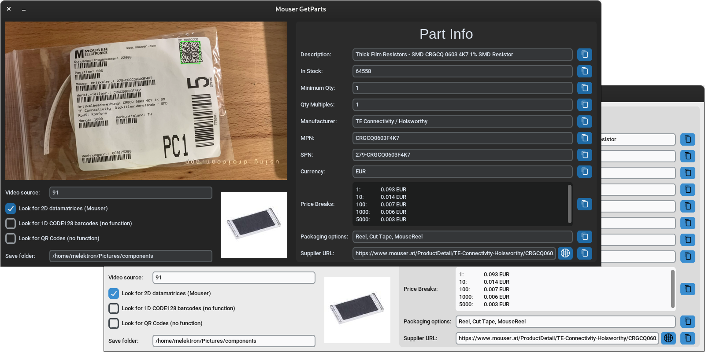

# What is GetParts?



GetParts is a small GUI tool that scans supplier barcodes on part bags and looks up part information using the supplier API. This currently works only for Mouser, as that is what I needed but is expandable to different suppliers.


## Features

- Live video preview
- Flexible selection of video sources with live switching ability
  - Local video devices (e.g. "/dev/video0", denoted by "0")
  - Files
  - Network streams
  - (anything else OpenCV supports)
- Support for detecting various codes
  - 2D Datamatrix
  - 1D Barcode (multiple encodings possible, mainly CODE128)
  - QR Code
- Supported manufacturer codes
  - Mouser 2D datamatrix
  - (more can be easily implemented when needed)
- Automatic fetch and display of relevant part info from supplier APIs 
  - Description
  - Stock
  - Minimum and Multiple Quantities
  - Manufacturer
  - MPN (manufacturer part number)
  - SPN (supplier part number) 
  - Price breaks for various quantities
  - Packaging options
  - Supplier product URL
- Automatic download, display and save of part image
- Quick-Copy to clipboard buttons for all fields


## Why?

Nearly every electrical component ordered online will be packaged and marked with a barcode containing relevant part information. When adding parts to an inventory management system (such as [InvenTree](https://inventree.org/)) it is useful to have an automatic tool that can retrieve all relevant information from the supplier just by placing the bag under a camera. With the Simple 


## How it works

The application scans the live camera feed for a variety of data codes, and looks up detected and relevant codes using supplier APIs, depending on which ones are enabled in the UI (currently only Mouser is supported).

It then downloads all part information and a preview image, and displays the relevant parts in the UI fields. When a Save folder is provided ("~/Pictures/components" by default), the downloaded part thumbnails are also saved in the supplied folder, so they can be easily imported into other software such as [InvenTree](https://inventree.org/), simply by sorting by modification date in the file picker.


## Setup and Usage

Clone the repo:

```bash
git clone https://github.com/melektron/getparts.git
cd getparts
```

To use the application, it is necessary to acquire API keys for all used supplier APIs (currently only Mouser).

The API keys have to be saved in the "src/api_keys.py" file (which is in .gitignore) in to following format:

```py
# you will need to create this file

MOUSER_API_KEY = "<your mouser API key>"
```

On Linux and MacOS you may also need to install the detection libraries using your system package manager, as they don't come bundled with their pip packages (on Windows they do):

```bash
# libdmtx (see https://pypi.org/project/pylibdmtx/)
# on macos
brew install libdmtx
# on debian based
sudo apt install libdmtx0a

# libzbar (see https://pypi.org/project/pyzbar/)
# on macos
brew install zbar
# on debian based
sudo apt install libzbar0
```

Then, create a python virtual environment and run the application inside it:

```bash
# pwd = getparts

python3.12 -m venv .venv
source .venv/bin/activate
# install dependencies
pip install -r requirements.txt

# run application
python main.py
```


### Getting Mouser API Key

Mouser's API is easier to set up but much more limited in its capability.

1. Navigate to https://www.mouser.com/MyMouser/MouserSearchApplication.aspx and register for Search API access (you can use your regular Mouser account for this). You can specify "GetParts" as the application, 1-10 users and "Private" as the company, but it doesn't really matter.
2. You will receive an email to confirm your registration.
2. After registration is confirmed, you will be shown your API key **once**. You should note it down and keep it a secret (don't push it to GitHub!)
3. Enter the API key into the above described file.


### Upstream tutorial

The setup documentation for maholli's original code can still be found in [scanning_tests/tutorial.md](scanning_tests/tutorial.md). This contains information about other suppliers.


## Inspiration and fork status

This tool was developed to aid inventory management via [InvenTree](https://inventree.org/). 

I originally found the tool [maholli/getparts](https://github.com/maholli/getparts). This tool supported reading DigiKey, Mouser and some LCSC bags. However this tool wasn't maintained, and not very user friendly. So I took inspiration and developed new program with a small user interface using customtkinter, which makes the process a lot easier.

Since I didn't have any DigiKey bags to test and didn't bother getting access to their API, I didn't implement DigiKey support in this new version, however this may change in the Future, should I have a need for it (feel free to contribute if you want to).

Even though this is a "fork" of the original project, the GUI GetParts application has almost nothing in common with maholli's version. Parts of the original code are however still included in the [scanning_tests](scanning_tests/) folder.
